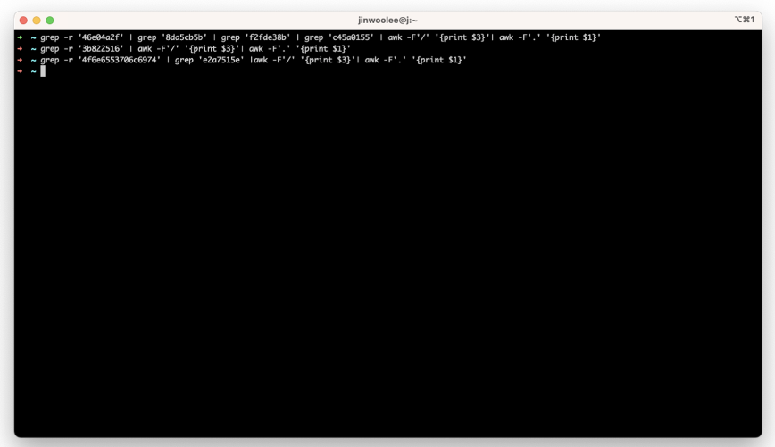

# Solve Method

0) I will explain the solution to the Free Real Estate problem that We solved in the Paradigm CTF.

1) The goal of the problem was to drain maximum of 214 million INU tokens distributed over 146,000 eligible addresses. Analysing 146,000 eligible addresses individually was impractical, so we came up with several effective methods to tackle the problem.

2) First, we sorted the 146,000 addresses by the amount of INU they received and created a priority order. At the same time, we created a bot that would inform us in real time of the score differences in Free Real Estate via the Discord bot. This was incredibly useful in the early stages as we could see which contracts other teams were targeting to drain INU. However, in the later stages, Contract tracking became difficult as teams were submitting their drained scores from multiple contracts all at once.

3) Our team manually analyzed contracts while also starting to identify similar contracts targeting the ones we secured early on. Using mainnet rpc, we retrieved the bytecode of deployed contracts using getCode and initially excluded contracts that had already self-destructed.

4) We then categorized contracts with specific bytecode patterns separately. We believed that Free Real Estate rankings would be determined by very narrow margins, so while other team members analyzed contracts manually, Jinu and I executed proof-of-concept (POC) tasks on hundreds of vulnerable contracts.

5) Foundry provided a feature to read JSON, but it was more challenging than Python. It lacked dictionary-like structures, so we had to process the provided airdrop-merkle-proofs.json and We saved processing data into process_data folder. You can find the processed code at (), and the processed data at ().

6) Even after processing, there were still too many entries, and we had to run the Foundry script 8 times.

7) After completing the Foundry script, everyone had to analyze contracts until the end of the competition manually, and we were able to achieve second place in this challenge.

8) During this challenge, we worked like a team of soldiers, and personally, this problem was the most enjoyable.