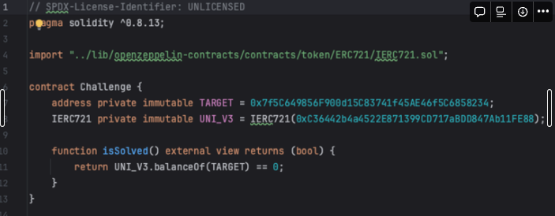
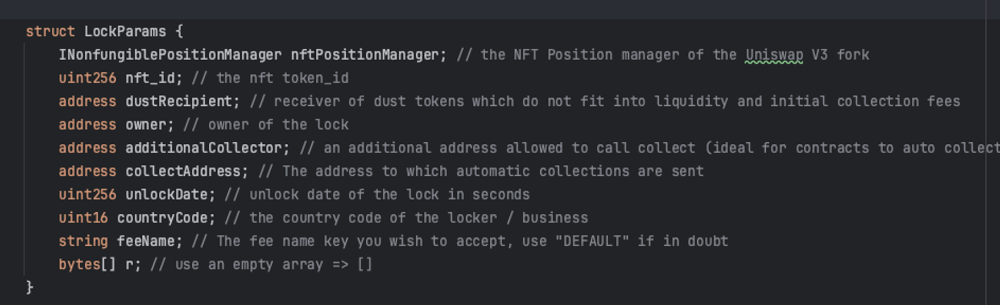
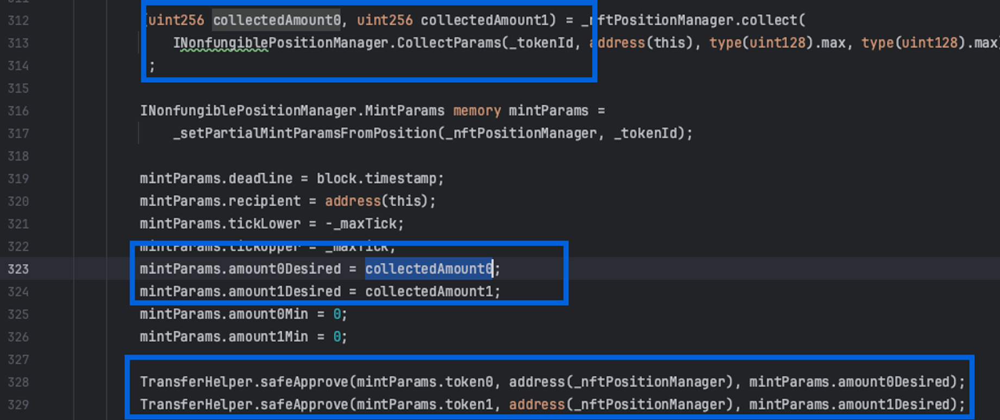

# Solve Method

0) I will explain the solution to the Token Locker problem that I solved in the Paradigm CTF.

1) To unlock Token Locker, we first looked at the conditions that needed to be met in Challenge.sol.
The condition was to drain all UNI_V3 NFTs from 0x7f5C649856F900d15C83741f45AE46f5C6858234."

2) Since the goal was to drain NFTs from the Target Contract, we first checked where the approve, transfer, and transferFrom functions were being called.
Whether it was ERC20 or ERC721 didn't matter. In the case of ERC20 and ERC721, the approve, transfer, and transferFrom functions can be called with the same ABI, so if user input was allowed, we could manipulate the situation where ERC721 tokens were transferred when ERC20 tokens were supposed to be sent.

3) The struct of the data passed as a parameter to the Lock function in the UNCX_ProofOfReservesV2_UniV3 contract looked like the image below.
   There was no code to check whether nftPositionManager was a malicious one or not.

4) By replacing nftPositionManager with a custom-made contract, we were able to bypass all the conditions that checked values derived from nftPositionManager.
The code snippet below is part of the _convertPositionToFullRange function called in the lock function.
Ultimately, due to the absence of code that verifies whether nftPositionManager is valid, we could manipulate all three parameters of the approve code and drain all the tokens within the target contract.
Originally, the code was intended to receive fees (ERC20) generated from Liquidity Providing in nftPositionManager and then redeposit them into nftPositionManager. However, by exploiting the points mentioned above, we were able to drain NFTs from the target contract and solve the problem.
